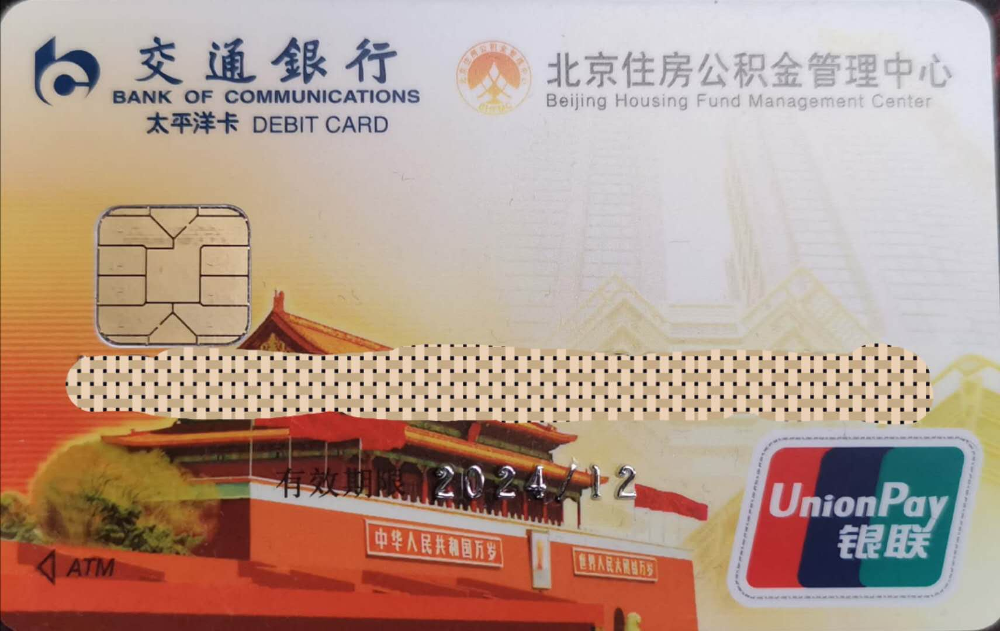
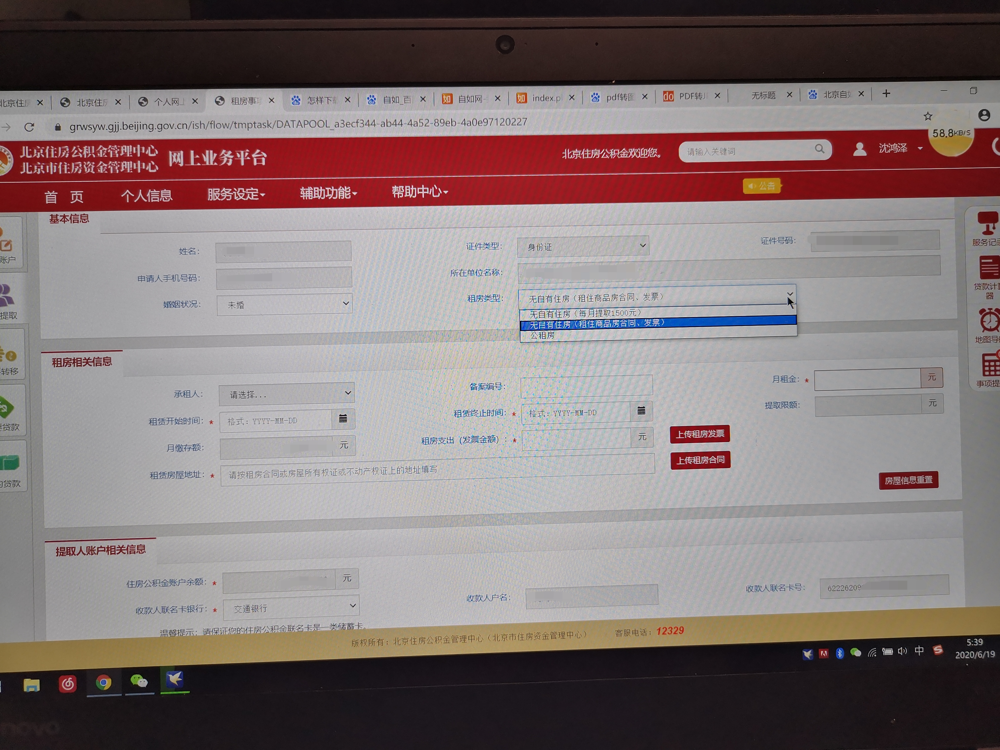

## 需要准备的东西

* 一张一类公积金联名卡
* 自如房租发票
* 自如房租合同

---

### 公积金联名卡

一类我的理解一般来讲是指你在某个银行办的第一张银行卡（貌似每个银行只能有一张一类银行卡）

办理时需要跟银行柜员说明你要办的是***公积金联名银行卡*** 

办理时需要带身份证，办理时长大概10分钟左右，很快

我去的是交通银行，办理时需要手机下载交通银行app进行银行卡绑定，全程柜员协助操作，所以很快

公积金联名卡大概长这样：

从相关的银行app中可以查到你的公积金余额，同理，你的公积金提取后也是转入这张卡中

### 自如房租发票

北京自如申请开票比较容易，但是要**注意**：

> **开票时长**：这个一般来说开三个月的发票，~~但是有一回电梯跟leader聊天发现他说他每个月都提取~~，所以说貌似也可以开单个月的（但是确实比较麻烦），推荐还是三个月一开

> **开票方式**：打开**自如app** --> 右下角**我的** --> **我的合同** --> 点击一下合同进入详情 --> **申请发票** --> **申请房租发票** --> 抬头个人（别写公司）+ 纳税人识别号填身份证号 + 发票月份**从头开始**勾上三个月的 --> 收票人信息写你现在的收货地址

**发票月份**这个别从当前月往前数，从你开始租这个房子的月份开始数才行（发票上对应的租房月份跟公积金啥会发没关系，但是你从当前月开始开之前的貌似就不能开还是咋的来着，反正从租房那个月开始开就对了）

**收票人信息**这个对应你现在方便的收货地址，发票会以顺丰快递的方式送过来，所以注意填一下

然后提交就行了，同样在申请发票这里能查看发票流程信息，我记得是核验中 --> 开票中 --> xxx（忘了）

大概不到一周就能拿到发票

拿到发票之后你需要一份发票的照片，这里方式可以随意一些，可以用手机app扫描全能王直接拍，有条件也可以复印一下，反正最后的格式需要是图片，jpg或者png

### 自如房租合同

反正我这个安卓自如app有点坑，app中不能直接下载合同，想要下载合同需要到pc端自如官网登录下载

~~后来我发现不下载也行~~

后期提交的住房公积金提取申请时需要合同一些页面的图片，格式同上

### 官网提交申请

登录[北京住房公积金官网](http://gjj.beijing.gov.cn/) ，点击个人网上业务平台，点击（北京中心）

**注意**：只有办理了公积金联名银行卡才能注册用户

没注册的赶紧注册，注册之后就能查看绑定的银行卡了

接下来点击左侧的我要提取，提取住房公积金，提取申请，**注意**业务办理时间为工作日9:00~19:00

***接下来是重点***

在登录了之后左侧有功能栏，选择**我要提取** --> **提取住房公积金** --> **提取申请**

之后选择租房xxx（具体我忘了）

然后页面大概如图所示：

注意**租房类型**选择第二个，也就是图中蓝色那个，租赁开始和结束时间按照合同上的填就行。月租金在自如app上我的合同可以看，发票金额如实填写，**租赁房屋地址**写合同上的地址

上传租房发票那里传一下发票的图片，格式上面有说

上传租房合同那里需要传蛮多，不过合同上都能找到对应点，这个其实感觉自如app手机端打开合同截图就行（我感觉）

确认信息无误就可以提交了，正常来说可以提取的钱是min(房租, 公积金月缴存额) * 发票月数

祝大家提取顺利~哦吼吼吼~~~

